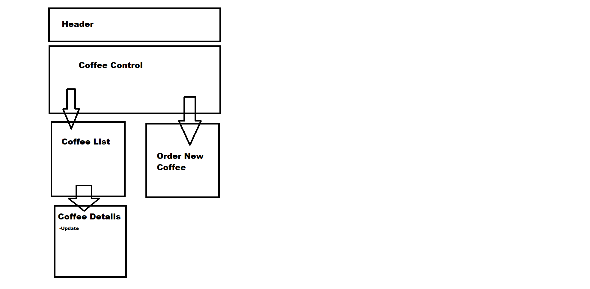

# Coffee Shop Inventory
#### Project by Elliot McGonigal
## Description
This is a webpage that will allow the owner of a coffee shop to update their inventory and keep track of coffee
## Technologies Used
* Javascript
* React
* HTML
* JSX
* CSS
## Setup
1. Clone down repository from Github
2. Use the terminal to navigate to the repository
3. Type "npm run build"
4. After it builds, enter "npm run start"
5. Now keep up that coffee inventory!

## Component Diagram

## Known Bugs
Buttons do not highlight, but they still function as buttons.
## License
GNU gpl 3.0 view LICENSE for more details